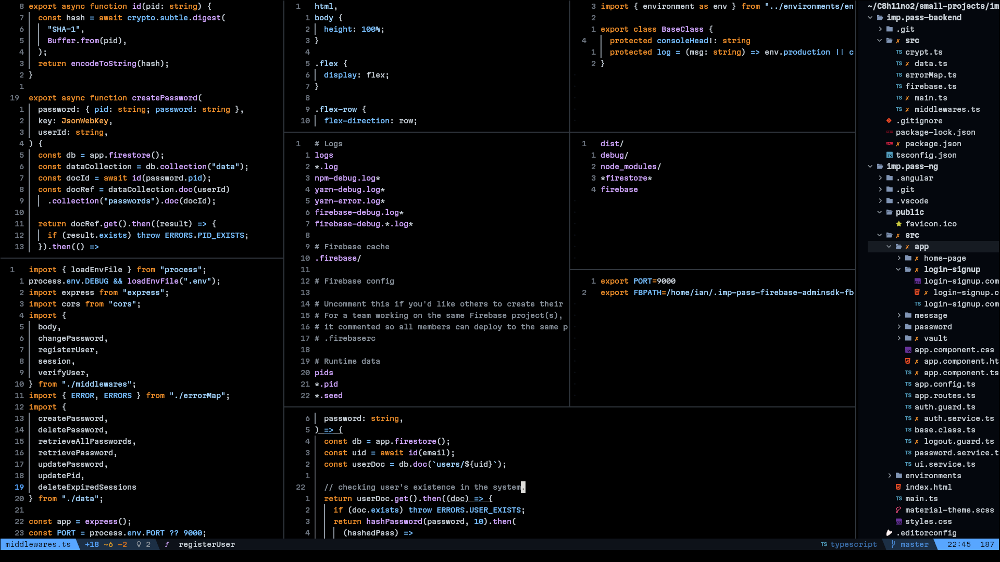

# `vipulkmr02`'s Dots


# 🚀 My Neovim Configuration (A Modern Setup)

Welcome to my personal Neovim configuration! This setup is designed to be a fast, modern, and feature-rich development environment built entirely on **Lua**. It aims to provide the power of an IDE right within your terminal.

## This is how it looks



---

## ✨ Features at a Glance

* **⚡ Blazing Fast:** Uses **`lazy.nvim`** for ultra-fast, on-demand plugin loading.
* **🧠 Intelligent Code Completion (LSP):** Full Language Server Protocol (LSP) integration for features like go-to-definition, hover documentation, refactoring, and more.
* **🌳 File & Buffer Navigation:** Easy navigation with **`nvim-tree`** and enhanced buffer management.
* **⌨️ Custom Keymaps:** Sensible and intuitive custom keybindings for common tasks (check `lua/keymaps.lua`).
* **Git Integration:** Excellent integration with Git using plugins like **`gitsigns.lua`**.
* **💡 AI Assistance:** Integration with **`copilot.lua`** and **`_chatgpt.lua`** (assuming you have the services configured).

---

## 📦 Installation

### Prerequisites

You'll need a few things installed on your system before you get started:

1.  **Neovim:** Version **0.8.0** or higher (I recommend the latest stable release).
2.  **Git:** Required for cloning this repository and for plugin management.
3.  **Lua:** For running the configuration files.
4.  **A Nerd Font:** Recommended for proper display of icons and symbols (e.g., [Fira Code Nerd Font](https://www.nerdfonts.com/)).

### Steps

1.  **Backup (Optional):** If you have an existing Neovim configuration, back it up:
    ```bash
    mv ~/.config/nvim ~/.config/nvim_old
    ```
2.  **Clone the Repository:** Clone this repository into your Neovim configuration directory:
    ```bash
    git clone [https://github.com/vipulkmr02/dots.git](https://github.com/vipulkmr02/dots.git) ~/.config/nvim
    ```
3.  **Launch Neovim:** Open Neovim. The **`lazy.nvim`** plugin manager will automatically start, download, and install all the necessary plugins.
    ```bash
    nvim
    ```
4.  **Install Language Servers:** You'll likely need to run a command to install the specific language servers for your projects. This config uses **`mason.lua`** to manage these.
    * Inside Neovim, type `:Mason` to open the installer UI.
    * Select and install the language servers (e.g., `lua_ls`, `eslint`, `tsserver`) you need.

---

## ⚙️ Configuration Structure

All configuration is written in **Lua** and organized logically:

| File/Directory | Purpose |
| :--- | :--- |
| **`init.lua`** | The main entry point. Loads the plugin manager (`lazy-installer.lua`) and sets global options. |
| **`lua/`** | Contains all the core logic and configuration files. |
| **`lua/keymaps.lua`** | Defines all custom keybindings (shortcuts). **This is where you change your hotkeys!** |
| **`lua/functions.lua`** | Contains general utility Lua functions used across the config. |
| **`lua/plugins/`** | The directory that holds all your plugin configurations. |
| **`lua/plugins/lsp.lua`** | Handles the configuration for **LSP (Language Server Protocol)** and **`mason.lua`**. |
| **`lazy-lock.json`** | Managed by `lazy.nvim`. **Do not edit this file!** |

---


## My Tmux configuration

# ⚡️ Modern TMUX Configuration

Welcome to my customized and feature-packed TMUX setup! This configuration is designed to turn your terminal sessions into a powerful, information-rich, and visually appealing workspace.

## ✨ Key Features

* **Custom Widgets:** An enhanced status bar with real-time performance metrics (CPU, Memory, Battery).
* **Dynamic Emojis:** A fun, rotating **random emoji** feature in the active window status.
* **Vim-Style Navigation:** Uses the **`vi` mode** for copy/scroll, and custom pane switching keys (`h`, `j`, `k`, `l`).
* **Plugin Management:** Easy setup and extension using **`tpm`** (Tmux Plugin Manager).
* **Slanted Status Bar:** Uses custom Unicode characters (`nc`, `ncf`, `nc2`, `nc2f`) for a modern, powerline-like status bar style.

---

## 📦 Installation

### Prerequisites

1.  **TMUX:** Version 3.0 or higher is recommended.
2.  **`tpm`:** Tmux Plugin Manager (installed below).
3.  **A Nerd Font:** Required for displaying the icons (like `󰂄`, ``, ``) and the slanted status bar separators correctly.
4.  **Linux Utilities (for Widgets):** The custom widgets script relies on **`acpi`**, **`free`**, **`top`**, and **`xset`** (for Caps Lock status). These tools must be installed for the status bar to function fully.

### Setup Steps

1.  **Clone the Config:** Place the `tmux.conf` file in your home directory. You may also want to create a `.tmux` folder to house the widgets script.

    ```bash
    # Assuming you put the files in ~/.tmux/
    cp tmux.conf ~/.tmux.conf
    cp tmux-widgets.sh ~/.tmux/
    chmod +x ~/.tmux/tmux-widgets.sh # Make sure the script is executable
    ```

2.  **Install `tpm` (Tmux Plugin Manager):**

    ```bash
    git clone [https://github.com/tmux-plugins/tpm](https://github.com/tmux-plugins/tpm) ~/.tmux/plugins/tpm
    ```

3.  **Start TMUX and Install Plugins:**

    * Start a new TMUX session: `tmux`
    * Press the prefix key (`M-f` or `M-=`) followed by **`I`** (uppercase i) to fetch and install the plugins listed in `tmux.conf`.

4.  **Reload Config:** If you make changes, reload the configuration file by pressing the prefix key followed by **`r`**.

---

## 🛠 Status Bar & Widgets

The status bar is highly customized and is split into three main parts: `status-left`, `window-status-current-format`, and `status-right`.

### 1. The Right Side (The Widgets)

The right side of the status bar uses the custom script `~/.tmux/tmux-widgets.sh` to display real-time system information.

| Feature | Script Function | Icon/Format | Dependency |
| :--- | :--- | :--- | :--- |
| **Battery Status** | `battery` | `󰁹` (or `󰂄` if charging) | `acpi` |
| **CPU Usage** | `cpu` | `` | `top` |
| **Memory Usage** | `mem` | `` | `free` |
| **Caps Lock Indicator** | `caps_lock` | `󰘲` (only appears if Caps Lock is ON) | `xset` (Linux X11) |

### 2. The Window Status (The Emoji)

The active window status displays a **random emoji** using the `random_emoji` function from the script. This emoji changes every time the status bar refreshes (every 1 second).

```tmux
set -g window-status-current-format "#[bold,fg=$s]#($WIDGET random_emoji) #W "
